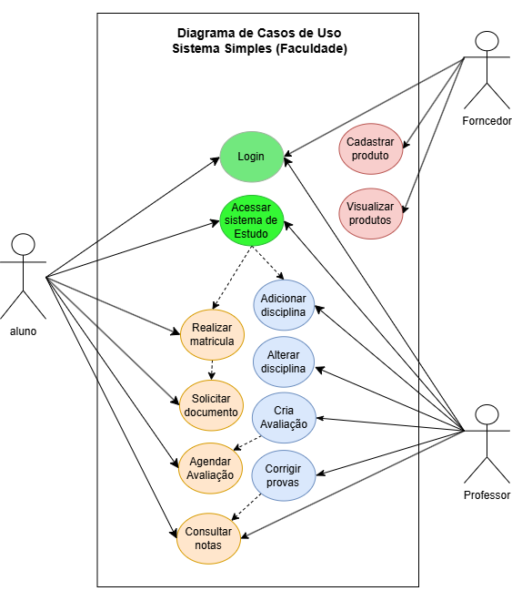
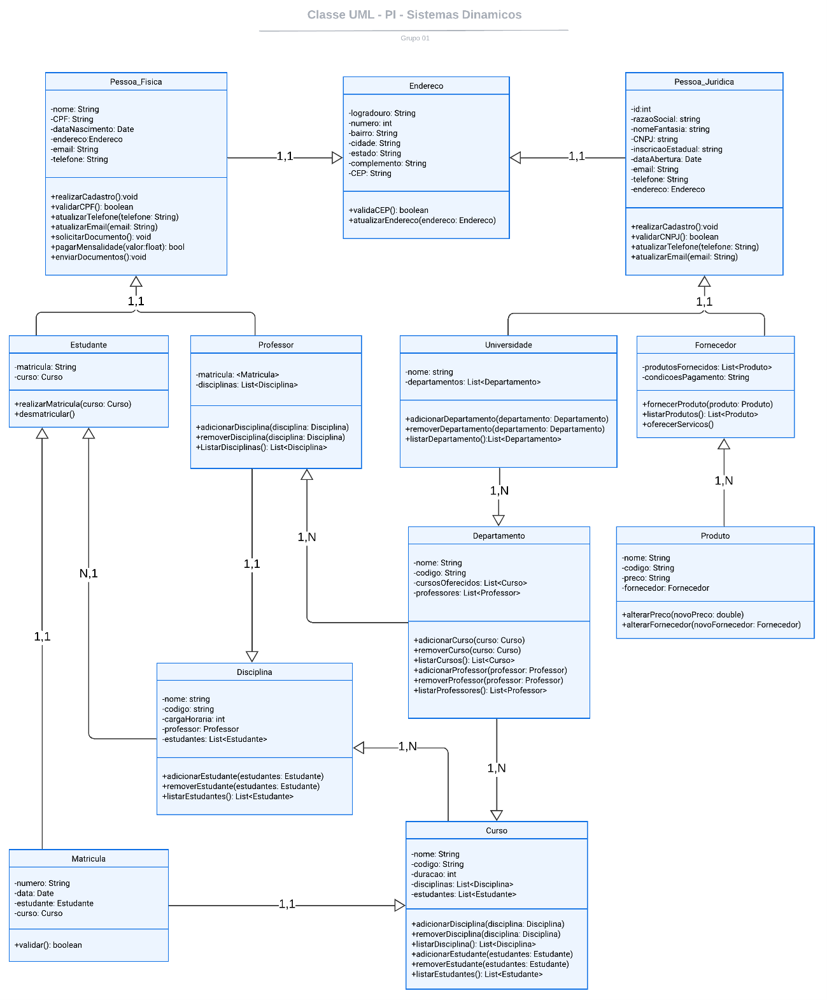

# PTI_Fase_2
## Figma do protótipo do projeto: (por enquanto ficará aqui em cima pra facilitar)
[figma do projeto](https://www.figma.com/design/JMBmNSFHi2kDqqlfhzSObK/EAD-SENAC-Protótipo?node-id=0-1&
node-type=CANVAS&t=CGADQpEPLL4L9SjR-0)

## Sobre:

## Funcionalidades:

### Todos os usuários:
* Login 

### Aluno:
* Acessar o sistema de estudo
* Realizar matrícula
* Solicitar documento
* Agendar avaliação
* Consultar notas

### Professor:
* Adicionar disciplina
* Alterar disciplina
* Criar avaliação
* Corrigir provas

### Fornecedor:
* Cadastrar produtos
* Visualizar produtos

## Diagramas
### Diagrama de caso de uso:

### Diagrama de classe:

## Telas:

## PI - 3º Semestre - Grupo 01 Fase 01

## Desenvolvedores:
[ANTONIO GABRIEL DE OLIVEIRA](#)
[BIANCA SILVA BARCELOS](#)
[DIEGO DE LIMA FOGACA](https://github.com/DiFogaca)
[KLEVERTON MACHADO KULMANN](#)
[LEILANE CATHERINE JOHN HIRT](https://github.com/leilanehirt)
[MANOELA DE ARAUJO CUNTIN HARRISON](#)
[PETERSON FONSECA SIMIAO](#)
