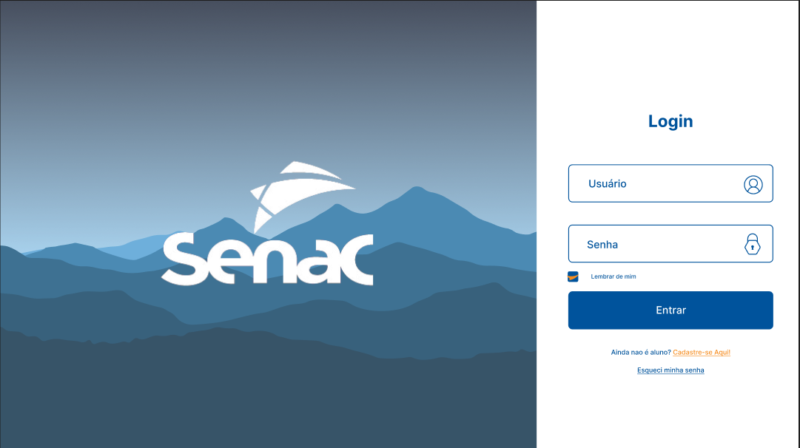
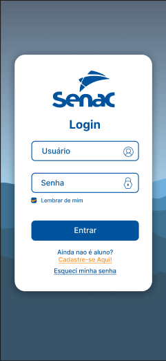
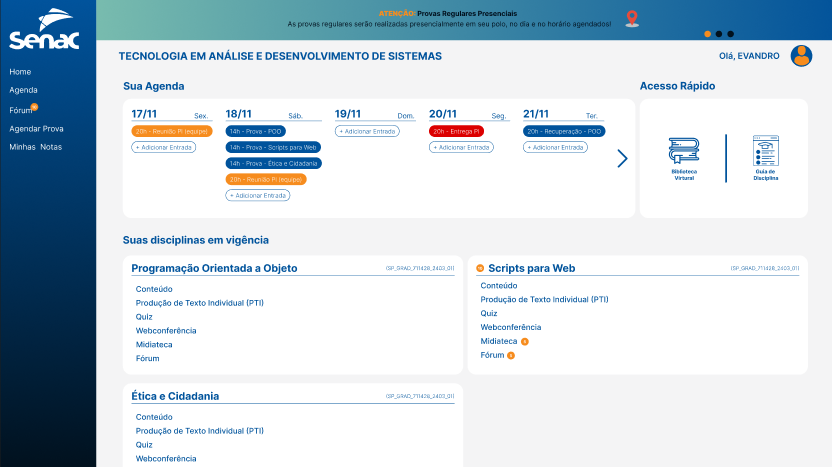
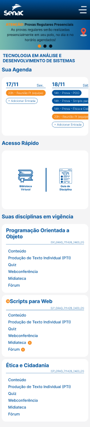
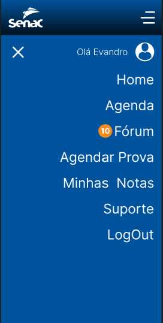

# PI_TSI_Fase_2

## Tópicos

* [Sobre](#Sobre)
* [Funcionalidades](#Funcionalidades)
* [Diagramas](#Diagramas)
* [Telas](#Telas)
* [PI Entrega 3º semestre](#PI---3º-Semestre---Grupo-01-Fase-01)
* [Desenvolvedores](#Desenvolvedores)

## Sobre

Este Projeto Integrador desenvolve um sistema educacional universitário inovador, focado em criar uma plataforma intuitiva e acessível para estudantes e professores, promovendo uma experiência de uso agradável e eficiente. O projeto aborda três casos de uso críticos: acesso dos alunos ao material de estudo, publicação de materiais de aula pelos professores e entrega de materiais de escritório por fornecedores. Propomos cenários alternativos para esses casos, descrevendo processos simplificados. Incluímos Diagramas de Classes UML (Linguagem de Modelagem Unificada) e um Diagrama de Casos de Uso, complementando a estrutura do sistema e facilitando a implementação das funcionalidades propostas.

## Funcionalidades

Abaixo encontram-se todas as funcionalidades desenvolvidas

### Todos os usuários
* Login 

### Aluno
* Acessar o sistema de estudo
* Realizar matrícula
* Solicitar documentos
* Agendar avaliação
* Consultar notas

### Professor
* Adicionar disciplina
* Alterar disciplina
* Criar avaliação
* Corrigir provas

### Fornecedor
* Cadastrar produtos
* Visualizar produtos

## Diagramas
### Diagrama de caso de uso

### Diagrama de classe

## Telas 

### Protótipo
[Link do protótipo do projeto Figma](https://www.figma.com/design/JMBmNSFHi2kDqqlfhzSObK/EAD-SENAC-Protótipo?node-id=0-1&node-type=CANVAS&t=CGADQpEPLL4L9SjR-0)

### Login
#### Desktop 🖥️

#### Mobile 📲

### Área do Aluno
#### Desktop 🖥️ 

#### Mobile 📲
|  |  |
|:-------------------------------:|:-------------------------------:|

### Área do Professor
#### Desktop 🖥️

#### Mobile 📲

### Ambiente de Aula
#### Desktop 🖥️

#### Mobile 📲

## PI - 3º Semestre - Grupo 01 Fase 01
[Documentação Fase 1 - Primeira entrega](file/PI_-_3º_Semestre_-_Grupo_01_Fase_01.pdf)

## Desenvolvedores
[ANTONIO GABRIEL DE OLIVEIRA](https://github.com/Arcane6)  
[BIANCA SILVA BARCELOS](https://github.com/BiancaBarcelos)  
[DIEGO DE LIMA FOGACA](https://github.com/DiFogaca)  
[KLEVERTON MACHADO KULMANN](https://github.com/KlevertonMKulmann)  
[LEILANE CATHERINE JOHN HIRT](https://github.com/leilanehirt)  
[MANOELA DE ARAUJO CUNTIN HARRISON](https://github.com/Manoelah20)  
[PETERSON FONSECA SIMIAO](https://github.com/PetersonFonsec)  
